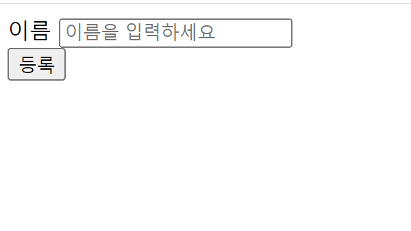

<!DOCTYPE html>
<html lang="en">
  <head>
    <meta charset="UTF-8">
    <meta name="viewport" content="width=device-width, initial-scale=1.0">
  </head>
  <body>
    <h1>회원가입 기능 구현</h1>
    <h2> 메인 페이지 </h2>
     
    <h2> 회원 가입 페이지 </h2>
    
    <h2> 회원 목록 페이지 </h2>
    
</body>
</html>